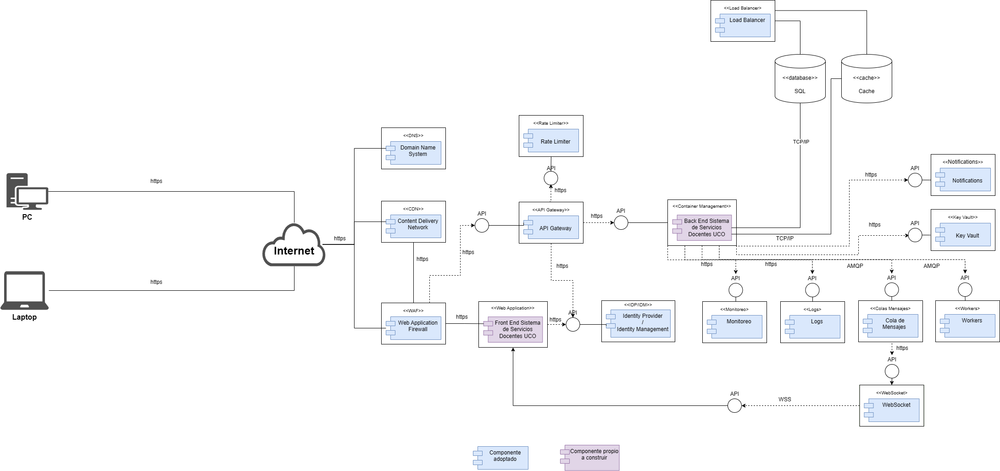
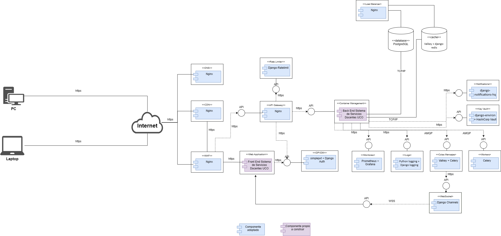
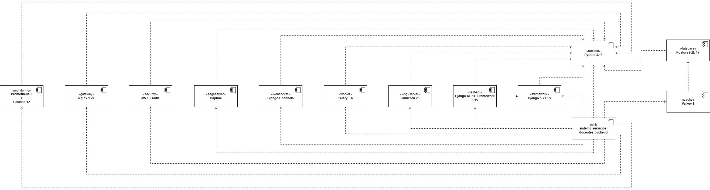
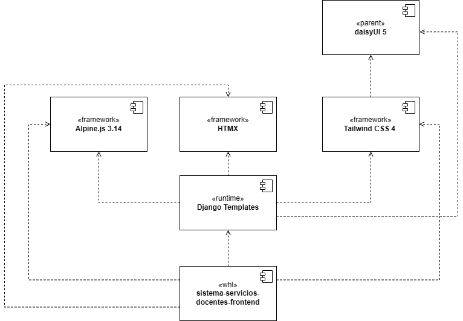
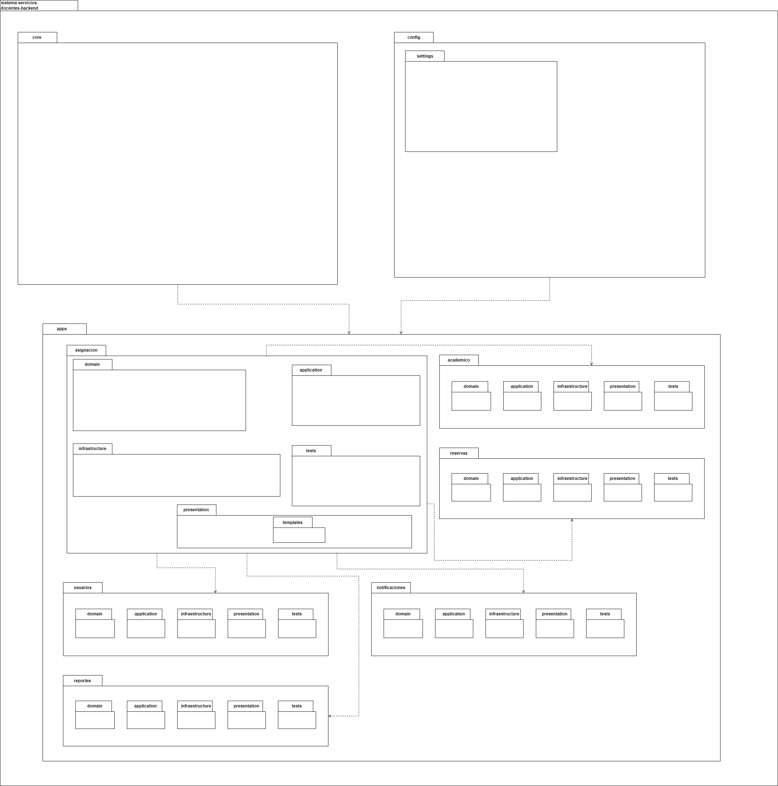
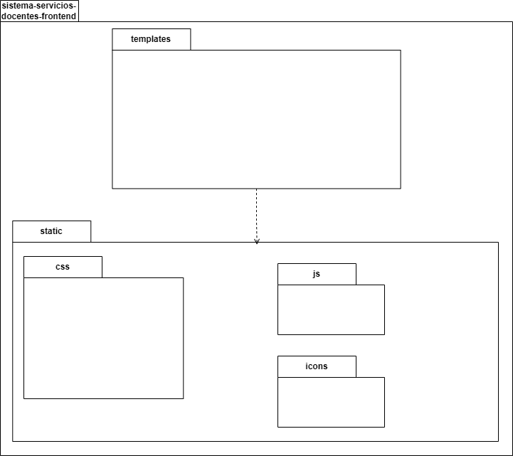

# Sistema de Servicios Docentes — Universidad Católica de Oriente (UCO)

## Desarrolladores

- Simón Alejandro Grisales Bedoya  
- Emmanuel Arcila Pérez    

Universidad Católica de Oriente — Ingeniería de Software II

---

> Aplicación web desarrollada para automatizar y optimizar el proceso de asignación académica de aulas en la Universidad Católica de Oriente (UCO). El sistema permite gestionar de manera eficiente la distribución de espacios académicos mediante validaciones automáticas de disponibilidad, capacidad y conflictos de horario, reduciendo significativamente errores operativos y tiempos de programación.
>
> La plataforma está construida bajo una arquitectura distribuida N-Tier y principios de Clean Architecture, utilizando tecnologías modernas como Python, Django, Django REST Framework, PostgreSQL, Valkey, Celery, Docker y Nginx. Además, incorpora monitoreo, procesamiento asíncrono, autenticación JWT, WebSockets y herramientas de observabilidad para garantizar escalabilidad, seguridad y mantenibilidad.
>
> El sistema está orientado a mejorar la eficiencia administrativa del área de Servicios Docentes, proporcionando simulaciones de asignación, notificaciones en tiempo real y reglas configurables alineadas con las políticas institucionales de la UCO.
>

---


---

La documentación técnica del proyecto describe:

- **Misión:** Propósito institucional del Sistema de Servicios Docentes, orientado a optimizar y automatizar la asignación académica de aulas en la Universidad Católica de Oriente, reduciendo conflictos operativos, mejorando la eficiencia administrativa y fortaleciendo la gestión de espacios académicos.

- **Especificación de requisitos:** Definición de requerimientos funcionales y no funcionales del sistema, incluyendo reglas de negocio, gestión de usuarios, asignación automática de aulas, simulaciones, validación de conflictos de horario, disponibilidad en tiempo real y criterios de rendimiento, seguridad y mantenibilidad.

- **Drivers arquitectónicos:** Identificación de los elementos que direccionan las decisiones de arquitectura del sistema, incluyendo:
  - Atributos de calidad con sus respectivas tácticas y estrategias arquitectónicas.
  - Funcionalidades críticas del proceso de asignación académica.
  - Restricciones de negocio relacionadas con tiempo, presupuesto, normativas institucionales y adopción tecnológica.
  - Restricciones técnicas basadas en Clean Architecture, principios SOLID, Docker, CI/CD, monitoreo y servicios stateless.

- **Arquetipo de referencia:** Selección y justificación de las tecnologías, frameworks y plataformas utilizadas en el proyecto, incluyendo Python, Django, Django REST Framework, PostgreSQL, Valkey, Celery, Docker, Nginx, HTMX, Alpine.js, Tailwind CSS, Prometheus y Grafana.

- **Arquitectura de referencia:** Descripción de la arquitectura distribuida N-Tier implementada en el sistema, contemplando separación por capas, modularidad, procesamiento asíncrono, WebSockets, observabilidad, autenticación JWT y despliegue basado en contenedores Docker.

- **Componentes:** Módulos lógicos de Frontend y Backend, sus responsabilidades y relaciones dentro del sistema. El Frontend está construido con Django Templates, HTMX, Alpine.js, Tailwind CSS y daisyUI, mientras que el Backend implementa servicios especializados como asignación académica, gestión de reservas, usuarios, reportes y notificaciones en tiempo real mediante Django REST Framework y Django Channels.

- **Paquetes:** Organización interna siguiendo Clean Architecture, separación por capas (domain, application, infrastructure y presentation), Screaming Architecture y principios SOLID. El sistema estructura sus módulos en aplicaciones independientes como asignación, académico, reservas, usuarios, reportes y notificaciones, favoreciendo mantenibilidad, escalabilidad y desacoplamiento.

- **Despliegue:** Componentes desarrollados y adoptados, junto con su distribución en una infraestructura basada en contenedores Docker. Incluye servicios como Nginx, Django, Daphne, Celery, PostgreSQL, Valkey, Prometheus y Grafana, además de la configuración de redes internas, volúmenes persistentes y monitoreo de la plataforma.

- **Secuencias:** Flujos funcionales típicos entre cliente web, Nginx como API Gateway y proxy inverso, servicios backend en Django, procesamiento asíncrono con Celery, WebSockets con Django Channels, caché distribuido con Valkey y persistencia en PostgreSQL. Se documentan procesos críticos como autenticación JWT, asignación automática de aulas, validación de conflictos y actualización en tiempo real de disponibilidad.
 
---

## Tabla de Contenidos

1. [Descripción del Proyecto](#descripción-del-proyecto)
2. [Especificación de Requisitos](#especificación-requisitos)
   - [Propósito](#propósito)
   - [Alcance del Sistema](#alcance-sistema)
   - [Funcionalidades Principales](#funcionalidades-principales)
   - [Requisitos No Funcionales](#requisitos-no-funcionales)
   - [Requisitos de Información](#requisitos-información)
   - [Requisitos Futuros](#requisitos-futuros)
3. [Drivers Arquitectónicos](#drivers-arquitectónicos)
   - [Atributos de Calidad](#atributos-de-calidad)
   - [Funcionalidades Críticas](#funcionalidades-críticas)
   - [Restricciones de Negocio](#restricciones-de-negocio)
   - [Restricciones Técnicas](#restricciones-técnicas)
4. [Arquetipo de Referencia](#arquetipo-de-referencia)
5. [Arquitectura Referencial](#arquitectura-referencial)
6. [Modelos de Arquitectura](#modelos-de-arquitectura)
   - [Modelo de Componentes](#modelo-de-componentes)
     - [Modelo de Componentes Backend](#modelo-de-componentes-backend)
     - [Modelo de Componentes Frontend](#modelo-de-componentes-frontend)
   - [Modelo de Paquetes](#modelo-de-paquetes)
     - [Modelo de Paquetes Backend](#modelo-de-paquetes-backend)
     - [Modelo de Paquetes Frontend](#modelo-de-paquetes-frontend)
   - [Modelo Arquitectura por Capas Lógicas](#modelo-arquitectura-por-capas-lógicas)
     - [Modelo Arquitectura por Capas Lógicas Backend](#modelo-arquitectura-por-capas-lógicas-backend)
     - [Modelo Arquitectura por Capas Lógicas Frontend](#modelo-arquitectura-por-capas-lógicas-frontend)
   - [Modelo de Secuencia](#modelo-de-secuencia)
     -[Modelo de Secuencia Backend](#modelo-secuencia-backend)
     -[Modelo de Secuencia Frontend](#modelo-secuencia-frontend)
7. [Instalación y Ejecución](#instalación-y-ejecución)
   -[Prerrequisitos](#prerrequisitos)
   -[Levantar el proyecto](#levantar-proyecto)
   -[URLs del sistema](#urls-sistema)
   -[Ejecutar pruebas](#ejecutar-pruebas)
8. [Roles del Sistema](#roles-del-sistema)
9. [Estrategia de Ramificación Git](#estrategia-ramificación-git)
10. [Línea Base del Sistema](#linea-base-sistema)

---

## Descripción del Proyecto

Para el Área de Servicios Docentes de la Universidad Católica de Oriente que enfrenta conflictos y retrasos recurrentes en la asignación manual de aulas, lo que genera demoras en la definición y confirmación de espacios al inicio de cada semestre académico y afecta la eficiencia operativa del servicio, **Sistema de Servicios Docentes** es una aplicación web que automatiza esta asignación mediante validaciones de capacidad y disponibilidad.

La plataforma reduce de manera estimada entre un **50% y 60%** el tiempo operativo de programación y disminuye en más del **80%** los conflictos por cruces de espacios, permitiendo optimizar el uso de la infraestructura física, mejorar la eficiencia administrativa y fortalecer la confianza y la imagen institucional del servicio ante la comunidad académica.

A diferencia de soluciones como uPlanner, Scientia, CELCAT, Ad Astra, 25Live, Syllabus Plus, Infosilem, PowerCampus y Banner by Ellucian, este sistema se especializa exclusivamente en la asignación académica de aulas bajo criterios institucionales propios de la UCO, garantizando una solución ágil, contextualizada y alineada con los lineamientos internos de la universidad.

---

## Especificación de Requisitos

### Propósito

Definir y gestionar de manera centralizada los requisitos funcionales, no funcionales y de información del sistema, sirviendo como base para las etapas de análisis, diseño, desarrollo, pruebas e implementación.

### Alcance del Sistema

La plataforma se enfoca exclusivamente en la asignación automática de aulas académicas, permitiendo:

- Gestión de cursos, grupos, docentes, aulas y horarios.
- Ejecución de asignaciones automáticas de aulas.
- Validación de capacidad y disponibilidad.
- Detección de conflictos de horario.
- Consulta de asignaciones realizadas.
- Administración de usuarios y roles institucionales.

### Funcionalidades Principales

| ID | Funcionalidad |
|---|---|
| RF1 | Autenticación de usuarios |
| RF2 | Gestión de aulas |
| RF3 | Gestión de horarios |
| RF4 | Asignación automática de aulas |
| RF5 | Validación de conflictos |
| RF6 | Consulta de asignaciones |

### Requisitos No Funcionales

| ID | Requisito |
|---|---|
| RNF1 | Tiempo de respuesta menor a 3 segundos |
| RNF2 | Seguridad mediante autenticación institucional |
| RNF3 | Comunicación segura mediante HTTPS |
| RNF4 | Interfaz intuitiva y consistente |
| RNF5 | Disponibilidad mínima del 99% |
| RNF6 | Compatibilidad con navegadores modernos |
| RNF7 | Código modular y mantenible |
| RNF8 | Escalabilidad para futuras funcionalidades |

### Requisitos de Información

El sistema administra información relacionada con:

- Aulas y capacidad instalada.
- Grupos académicos y número de estudiantes.
- Docentes y cursos asignados.
- Horarios académicos.
- Resultados de asignaciones automáticas.

### Requisitos Futuros

- Reservas temporales de aulas.
- Notificaciones automáticas institucionales.
- Analítica predictiva para optimización de espacios.
- Integración con otros sistemas académicos institucionales.

---

## Drivers Arquitectónicos

### Atributos de Calidad

| Atributo | Código Caracteristica | Descripción | Código Escenario de Calidad | Escenario de medición |
|---|---|---|---|---|
| Capacidad para ser administrado	| ADM-01 | El sistema debe tener un monitoreo y control constante para poder mantener una observabilidad total del sistema y ayudar a detectar posibles fallas. | ESC-CAL-ADM-01-E002 | El administrador debe poder identificar errores de asignación mediante logs centralizados en menos de 1 minuto. |
| Confiabilidad | CONF-02 | El sistema debe evitar duplicidad de aulas en un mismo horario. | ESC-CAL-CONF-02-E002 |	Si dos procesos intentan asignar la misma aula en el mismo horario simultáneamente, el sistema debe rechazar una de las operaciones mediante restricciones de base de datos y mantener consistencia sin corrupción de datos. |
| Confiabilidad | CONF-03	| Las asignaciones reflejan datos válidos y actualizados. | ESC-CAL-CONF-03-E001 |	Cuando un grupo cambia su cantidad de estudiantes antes de la asignación, el sistema debe recalcular automáticamente las opciones de aula válidas sin permitir asignaciones inconsistentes. |
| Disponibilidad | DISP-04	| El sistema debe tener una alta disponibilidad (Soportar todo el periodo operativo de la universidad) | ESC-CAL-DISP-04-E003	| El sistema debe estar disponible el 98% del tiempo durante periodos de matrícula y además en tiempos regulres, como la jornada acádemica, teniendo en cuenta, asignación de aulas (Periodos cortos), laboratorios y salas de sistemas. |
| Disponibilidad | DISP-06 | El sistema ante cualquier falla debe poder realizar una recuperación rápida | ESC-CAL-DISP-06-E001	| Ante una caída del servidor, conexión con base de datos, transferencia o actualización de datos el sistema debe restablecer el servicio en menos de 2 minutos sin pérdida de datos. |
| Rendimiento | REND-05	| El sistema debe procesar eficientemente	| ESC-CAL-REND-05-E004 | El sistema debe completar la asignación de 500 grupos en menos de 5 segundos bajo condiciones normales. |
| Rendimiento	| REND-05 | El sistema debe soportar multiples usuarios | ESC-CAL-REND-05-E005 | El sistema debe soportar al menos 50 usuarios concurrentes sin degradación significativa en el tiempo de respuesta. |
| Seguridad	| SEG-01 | El sistema debe tener un control de acceso para poder verificar la identidad de los usuarios mediante credenciales válidas antes de permitir el acceso a las funcionalidades que tiene cada rol en el sistema. | ESC-CAL-SEG-01-E001	| Si un usuario intenta acceder a funcionalidades fuera de su rol, o intenta acceder con credencial invalidas el sistema debe bloquear la acción y registrar el intento en logs de seguridad. |
| Usabilidad | USA-05 | El sistema debe manejar un flujo intuitivo para usuarios administrativos. | ESC-CAL-USA-05-E001	| Un usuario nuevo debe poder completar el proceso de asignación sin capacitación en menos de 10 minutos utilizando la interfaz. |
| Usabilidad | USA-06 | Mensajes que sean comprensibles para el usuario. | ESC-CAL-USA-06-E001 | Cuando un líder intenta ejecutar la asignación sin datos completos, el sistema debe mostrar mensajes claros indicando exactamente qué información falta. |

---

### Funcionalidades Críticas

| Identificador | Historia de usuario | Justificación |
|---|---|---|
| **HU-0008**	| Como líder de servicios docentes, necesito ejecutar el proceso de asignación automática de aulas basado en disponibilidad y capacidad, con el fin de optimizar la distribución de espacios y reducir conflictos manuales en la programación académica.	| Esta funcionalidad es el núcleo del sistema, ya que concentra la lógica principal del negocio y requiere resolver un problema complejo de optimización con múltiples restricciones simultáneas. Su implementación implica retos algorítmicos, manejo de grandes volúmenes de datos y decisiones arquitectónicas críticas como procesamiento eficiente y desacoplamiento de reglas. |
| **HU-0009** | Como sistema, debo validar automáticamente que no existan conflictos de horarios entre asignaciones de aulas para diferentes grupos, con el fin de evitar cruces que afecten la operación académica. | Es una funcionalidad crítica porque garantiza la integridad operativa del sistema, evitando errores que impactan directamente la ejecución de clases. Su complejidad consiste en validar múltiples combinaciones en tiempo eficiente, lo que exige estructuras de datos optimizadas y decisiones arquitectónicas orientadas a rendimiento. |
| **HU-0023** | Como líder de servicios docentes, necesito ejecutar simulaciones de asignación de aulas sin afectar datos reales, con el fin de evaluar diferentes escenarios antes de realizar la asignación definitiva. | Es crítica porque implica replicar el comportamiento del núcleo del sistema en un entorno aislado, lo que introduce retos técnicos relacionados con manejo de datos temporales, consumo de recursos y consistencia entre simulación y ejecución real. Y también permite reducir riesgos operativos en decisiones institucionales importantes. |
| **HU-0026** | Como sistema, debo priorizar la asignación de aulas a grupos con mayor número de estudiantes, con el fin de optimizar el uso de la infraestructura institucional disponible. | Esta funcionalidad es crítica porque introduce lógica de priorización dentro del algoritmo principal de asignación, lo que aumenta significativamente la complejidad del sistema. No se trata solo de asignar, sino de decidir en qué orden hacerlo, lo que impacta directamente el diseño del algoritmo, el rendimiento y la calidad de las soluciones generadas, siendo clave en escenarios con recursos limitados. |
| **HU-0029** | Como sistema, debo validar la integridad y consistencia de los datos registrados, como relaciones entre cursos, grupos y horarios, con el fin de evitar errores en la asignación automática.	| Es crítica porque asegura la base estructural del sistema y previene errores que pueden propagarse a todos los procesos posteriores. Su implementación requiere validaciones complejas y eficientes, así como una arquitectura que garantice integridad referencial y coherencia de datos en todo momento. |
| **HU-0031** | Como sistema, necesito recalcular automáticamente las asignaciones de aulas cuando se presenten cambios en datos críticos como cantidad de estudiantes o disponibilidad de aulas, con el fin de mantener la coherencia y validez de la programación académica.	| Es crítica porque introduce comportamiento dinámico en el sistema, obligando a diseñar mecanismos eficientes para recalcular sin afectar el rendimiento global. Implica retos de consistencia, procesamiento incremental y posible uso de eventos o tareas asincrónicas para evitar reprocesamientos completos. |
| **HU-0033** | Como sistema, necesito gestionar múltiples solicitudes concurrentes de asignación de aulas sin generar inconsistencias en los datos, con el fin de garantizar la integridad del sistema durante periodos de alta demanda operativa. | Es crítica porque los problemas de concurrencia pueden generar corrupción de datos o duplicidad de asignaciones. Requiere decisiones arquitectónicas sólidas como control de transacciones, bloqueo de recursos o mecanismos de sincronización que aseguren la integridad del sistema en entornos multiusuario. |
| **HU-0040** | Como administrador del sistema, necesito definir reglas configurables para el proceso de asignación automática, con el fin de adaptar el sistema a políticas institucionales cambiantes sin necesidad de modificar el código.	| Es crítica porque introduce un motor de reglas dinámico que impacta directamente la arquitectura del sistema. Permite flexibilidad, pero aumenta la complejidad en ejecución y mantenimiento, requiriendo desacoplamiento entre lógica de negocio y reglas configurables, así como mecanismos eficientes de evaluación. |
| **HU-0048** | Como usuario de admisiones, necesito cargar o actualizar datos de múltiples grupos de manera masiva, con el fin de optimizar el tiempo operativo y reducir errores manuales. | Es crítica porque implica procesamiento intensivo de datos, validaciones complejas y potencial impacto en el rendimiento general del sistema. Requiere decisiones arquitectónicas como procesamiento por lotes o asincrónico, control de errores y mecanismos de recuperación ante fallos. |
| **HU-0053** | Como sistema, necesito soportar el incremento de datos como número de grupos o aulas sin degradar el rendimiento, con el fin de garantizar la sostenibilidad del sistema a largo plazo. | Es crítica porque define la viabilidad del sistema en escenarios reales de crecimiento institucional. Implica decisiones arquitectónicas clave como distribución de carga, optimización de procesos y diseño desacoplado que permita escalar sin afectar la estabilidad ni la experiencia del usuario. |
| **HU-0059** | Como sistema, necesito actualizar la disponibilidad de aulas en tiempo real ante cambios o reservas, con el fin de evitar inconsistencias en la información mostrada. | Es crítica porque introduce la necesidad de procesamiento en tiempo real y sincronización constante de datos, lo que impacta directamente la arquitectura del sistema. Requiere mecanismos eficientes para evitar inconsistencias, latencias o datos desactualizados en escenarios de alta concurrencia. |
| **HU-0060** | Como sistema, debo verificar que todos los grupos tengan aula asignada antes de finalizar el proceso de programación académica, con el fin de garantizar la cobertura total de la operación.	| Es crítica porque representa el cierre del proceso principal del sistema, y cualquier fallo en esta validación puede generar impactos operativos graves, como grupos sin espacio asignado. Requiere una verificación integral eficiente que considere múltiples variables y estados del sistema. |

---

### Restricciones de Negocio

| Tipo | Restricción de negocio | Justificación |
|---|---|---|
| **Humano** |	El equipo académico y administrativo involucrado en el proyecto dispone de tiempo limitado para participar en levantamiento de requerimientos, validaciones funcionales y pruebas del sistema debido a sus responsabilidades operativas institucionales. | Debido a que los usuarios clave como líderes y auxiliares de servicios docentes cumplen funciones críticas dentro de la programación académica institucional, su disponibilidad para reuniones, validaciones y retroalimentación puede ser reducida, generando riesgos en la correcta definición del sistema. |
| **Tiempo** | El sistema debe estar disponible antes del inicio del proceso institucional de programación académica del semestre correspondiente para generar valor operativo real. | Si el sistema no está listo antes de la fase crítica de asignación de aulas, la institución deberá continuar utilizando procesos manuales, generando pérdida de oportunidad, reprocesos administrativos y baja adopción tecnológica. |
| **Legal** | El sistema debe garantizar el cumplimiento de la normativa colombiana relacionada con protección de datos personales (Habeas Data) y políticas institucionales de manejo de información académica. | El sistema manejará datos personales como nombres de docentes, información académica y asignaciones institucionales, lo cual implica responsabilidad legal sobre su almacenamiento, acceso y tratamiento adecuado. |
| **Presupuesto** | El proyecto del sistema de servicios docentes debe desarrollarse utilizando únicamente recursos tecnológicos que la universidad pueda adquirir, mantener y escalar sin generar presión financiera, garantizando que los costos asociados a licencias, infraestructura, operación y soporte se mantengan dentro de las capacidades económicas reales de la institución en el corto, mediano y largo plazo.	| Las instituciones educativas manejan presupuestos limitados y priorizan la inversión en aspectos académicos como infraestructura física, investigación y docente. Por esta razón, cualquier solución tecnológica debe ser financieramente sostenible, evitando dependencias de herramientas costosas o modelos de pago difíciles de mantener, lo que podría comprometer la continuidad operativa del sistema en el tiempo. |
| **Alcance** | Existe incertidumbre respecto a futuras necesidades funcionales del sistema, como integración con otros sistemas académicos institucionales o ampliación hacia programación completa de horarios.	| El sistema se enfoca inicialmente solo en asignación automática de aulas, pero la evolución natural del negocio puede requerir nuevas funcionalidades que impacten el diseño si no se prevé escalabilidad. |
| **Humano** |	El nivel de adopción tecnológica por parte de algunos usuarios administrativos puede ser bajo, generando resistencia al cambio frente a la automatización del proceso. | Los procesos manuales han sido utilizados históricamente en la institución, por lo que la introducción de una solución digital puede generar desconfianza o uso incorrecto del sistema. |
| **Humano** |	El conocimiento funcional del proceso de asignación se encuentra concentrado en pocas personas dentro del área de servicios docentes. | La dependencia de expertos institucionales puede generar cuellos de botella si estos no están disponibles durante el desarrollo. |
| **Presupuesto** | El sistema debe minimizar costos futuros de mantenimiento y soporte técnico para garantizar sostenibilidad institucional. | Un sistema costoso de operar puede ser abandonado o reemplazado incluso si técnicamente funciona bien. |
| **Legal** | El sistema debe respetar normativas institucionales internas sobre uso de infraestructura física académica. | Las universidades suelen tener políticas internas sobre prioridad de aulas, reservas especiales o restricciones operativas. |

---

### Restricciones Técnicas

| Categoría | Restricción |
|---|---|
| **Prácticas de diseño** | El diseño y desarrollo debe seguir principios SOLID para garantizar modularidad y mantenibilidad |
| **Prácticas de diseño** | El sistema debe propender por una arquitectura modular basada en separación de responsabilidades entre capas: dominio, aplicación, infraestructura y presentación (Clean Architecture) |
| **Prácticas de diseño** | El sistema debe diseñarse considerando principios de aplicaciones reactivas: resiliencia, capacidad de respuesta y elasticidad |
| **Marco metodológico** | El desarrollo debe realizarse utilizando un framework iterativo para organizar entregas y validaciones continuas con backlog priorizado por valor operativo y riesgo técnico |
| **DevOps** | El sistema debe implementar integración continua para validar automáticamente compilación, pruebas y calidad del código en cada push |
| **DevOps** | El despliegue debe realizarse mediante contenedores Docker para garantizar portabilidad entre entornos |
| **DevOps** | El sistema debe implementar monitoreo técnico de disponibilidad, errores y rendimiento |
| **Clean Code** | El código fuente debe seguir principios de Clean Code evitando code smells y promoviendo legibilidad con convenciones de nombres descriptivas |
| **Pruebas** | El sistema debe mantener cobertura de pruebas unitarias sobre componentes críticos del proceso de asignación |
| **Patrones** | El sistema debe utilizar el patrón Repository para abstraer el acceso a datos |
| **Patrones** | El proceso de asignación debe implementarse con el patrón Strategy para soportar múltiples algoritmos intercambiables |
| **Patrones** | El sistema debe aplicar el patrón Factory para la creación controlada de entidades complejas |
| **Versionamiento** | Control de versiones estructurado mediante ramas: `feature/*` → `develop` → `main` |
| **Stateless** | Todos los servicios backend deben ser stateless para facilitar escalabilidad horizontal |

---

## Arquetipo de Referencia

El siguiente arquetipo de referencia presenta los componentes para el desarrollo del Sistema de Servicios Docentes, con el fin de establecer una base arquitectónica estandarizada que garantice mantenibilidad, escalabilidad, seguridad y compatibilidad con los requerimientos institucionales del proyecto.

| Componente | Justificación | Tipo Adquisición |
|---|---|---|
| Cliente (Frontend Web) | La separación entre la capa de presentación y la lógica de negocio es un principio fundamental de la arquitectura N-Tier. Mantener el cliente como una capa independiente favorece la modificabilidad, ya que cambios en la interfaz no afectan los servicios subyacentes. Al ser stateless, el cliente no almacena estado de sesión de forma permanente, lo que simplifica la escalabilidad horizontal del backend y mejora la disponibilidad general del sistema.<br><br>1. Driver 1: Usabilidad<br>2. Driver 2: Disponibilidad<br>3. Driver 3: Accesibilidad<br>4. Driver 4: Capacidad para ser mantenido | Desarrollo propio |
| Web Application Firewall (WAF) | La seguridad es un driver arquitectónico transversal en sistemas que gestionan información académica sensible. El WAF actúa como primera línea de defensa a nivel de capa de aplicación, bloqueando solicitudes maliciosas antes de que alcancen la lógica del sistema. Su presencia reduce la superficie de ataque e implementa principios de defensa en profundidad, especialmente relevante en sistemas institucionales que procesan datos de docentes, estudiantes y espacios físicos sujetos a regulaciones de protección de datos.<br><br>1. Driver 1: Seguridad<br>2. Driver 2: Disponibilidad<br>3. Driver 3: Reglas de Negocio (Normatividad)<br>4. Driver 4: Confiabilidad<br>5. Driver 5: Funcionalidad Crítica: Validación de integridad y consistencia de datos<br>6. Driver 6: Restricción de Negocio: Legal - Habeas Data | Adoptado |
| Domain Name System (DNS) | El DNS es un componente infraestructural crítico para la disponibilidad y el rendimiento. Permite implementar estrategias de balanceo de carga a nivel de red y facilita la conmutación por error (failover) en escenarios de alta disponibilidad. Adicionalmente, soporta mecanismos de caché a nivel de resolución, reduciendo la latencia percibida por el usuario final. En arquitecturas distribuidas es un requisito de infraestructura no aplicativo.<br><br>1. Driver 1: Disponibilidad<br>2. Driver 2: Rendimiento<br>3. Driver 3: Capacidad para ser desplegado | Adoptado |
| Content Delivery Network (CDN) | La inclusión de una red de distribución de contenido responde directamente al driver de rendimiento y experiencia de usuario. Al distribuir el contenido estático en nodos de borde, se reduce la latencia de red y se descarga al backend de solicitudes innecesarias. Esto impacta positivamente en la escalabilidad, ya que el servidor de origen puede destinar recursos exclusivamente al procesamiento de lógica de negocio. También mejora la disponibilidad al proveer redundancia geográfica para activos estáticos.<br><br>1. Driver 1: Rendimiento<br>2. Driver 2: Escalabilidad<br>3. Driver 3: Disponibilidad | Adoptado |
| API Gateway | El API Gateway responde a drivers de seguridad, mantenibilidad y escalabilidad. Al centralizar el punto de entrada, se evita la exposición directa de los microservicios a la red exterior, reduciendo la superficie de ataque. Permite implementar políticas uniformes de autenticación y monitoreo sin duplicar lógica en cada servicio. En arquitecturas de microservicios es fundamental para gestionar la complejidad del enrutamiento y garantizar una interfaz coherente para el consumidor, reduciendo el acoplamiento entre cliente y servicios internos.<br><br>1. Driver 1: Seguridad<br>2. Driver 2: Capacidad para ser mantenido<br>3. Driver 3: Escalabilidad<br>4. Driver 4: Rendimiento<br>5. Driver 5: Capacidad para ser desplegado<br>6. Driver 6: Funcionalidad Crítica: Concurrencia sin inconsistencias | Adoptado |
| Rate Limiter | Rate Limiter es un driver de disponibilidad y seguridad esencial en sistemas con múltiples actores concurrentes. Sin este mecanismo, un cliente con comportamiento anómalo, ya sea malicioso o por error de programación, podría saturar los recursos del sistema y degradar la experiencia de todos los usuarios. Al aplicarlo en la capa de entrada, se protege toda la cadena de procesamiento, optimizando el uso de recursos computacionales bajo condiciones de carga elevada o ataques coordinados de baja intensidad.<br><br>1. Driver 1: Disponibilidad<br>2. Driver 2: Seguridad<br>3. Driver 3: Rendimiento<br>4. Driver 4: Funcionalidad Crítica: Concurrencia sin inconsistencias | Adoptado |
| IDP/IDM | La identidad y el control de acceso son pilares de la seguridad en cualquier sistema de información institucional. Centralizar estas responsabilidades en un componente especializado elimina la necesidad de implementar lógica de seguridad dispersa en cada microservicio, reduciendo duplicación y riesgos. Permite implementar políticas de acceso basadas en roles de forma consistente, garantizando que cada actor acceda únicamente a las funcionalidades correspondientes a su perfil institucional. Es un driver de seguridad y mantenibilidad no negociable.<br><br>1. Driver 1: Seguridad<br>2. Driver 2: Confiabilidad<br>3. Driver 3: Usabilidad<br>4. Driver 4: Capacidad para ser mantenido<br>5. Driver 5: Restricción de Negocio: Legal - Habeas Data | Adoptado |
| Key Vault | La gestión segura de secretos es un requisito de seguridad no negociable en arquitecturas distribuidas de producción. Almacenar credenciales en código fuente o repositorios representa una vulnerabilidad crítica. El Key Vault permite rotación de secretos sin redespliegue de servicios, auditoría de accesos y control de expiración. Mejora la postura de seguridad y facilita el cumplimiento de políticas institucionales, reduciendo la superficie de exposición ante compromisos parciales de infraestructura. Para entornos académicos de desarrollo puede simplificarse.<br><br>1. Driver 1: Seguridad<br>2. Driver 2: Capacidad para ser mantenido<br>3. Driver 3: Restricción de Negocio: Legal - Habeas Data | Adoptado |
| Load Balancer | El balanceo de carga es un driver fundamental de escalabilidad y disponibilidad. Permite escalar horizontalmente los microservicios agregando instancias sin modificar la arquitectura. Facilita la continuidad del servicio ante fallos de instancias individuales, ya que el tráfico se redirige automáticamente a instancias saludables. En el contexto del sistema de asignación de aulas, donde pueden existir picos de demanda al inicio de semestres académicos, este componente es crítico para mantener el rendimiento y prevenir degradaciones por saturación de instancias individuales.<br><br>1. Driver 1: Escalabilidad<br>2. Driver 2: Disponibilidad<br>3. Driver 3: Rendimiento<br>4. Driver 4: Funcionalidad Crítica: Escalabilidad sin degradar rendimiento<br>5. Driver 5: Funcionalidad Crítica: Concurrencia sin inconsistencias | Adoptado |
| Servicios Backend (Aplicación) | Este componente resuelve el reto de escalabilidad y rendimiento. Al ser stateless, se pueden añadir o quitar instancias del servicio en cualquier momento sin perder datos, lo cual es esencial para manejar grandes volúmenes de concurrencia. Además, encapsula la complejidad de los algoritmos de negocio y el procesamiento transaccional.<br><br>1. Driver 1: Escalabilidad<br>2. Driver 2: Rendimiento<br>3. Driver 3: Confiabilidad<br>4. Driver 4: Disponibilidad<br>5. Driver 5: Seguridad<br>6. Driver 6: Usabilidad<br>7. Driver 7: Capacidad para ser probado<br>8. Driver 8: Capacidad para ser mantenido<br>9. Driver 9: Capacidad para ser administrado<br>10. Driver 10: Funcionalidad Crítica: Asignación automática de aulas<br>11. Driver 11: Funcionalidad Crítica: Priorización por número de estudiantes<br>12. Driver 12: Funcionalidad Crítica: Reglas configurables de asignación<br>13. Driver 13: Funcionalidad Crítica: Validación integridad de datos<br>14. Driver 14: Funcionalidad Crítica: Carga masiva de datos<br>15. Driver 15: Funcionalidad Crítica: Actualización disponible en tiempo real<br>16. Driver 16: Funcionalidad Crítica: Concurrencia sin inconsistencias<br>17. Driver 17: Funcionalidad Crítica: Validación conflictos de horarios<br>18. Driver 18: Funcionalidad Crítica: Verificación cobertura total de asignación<br>19. Driver 19: Restricción Técnica: Patrón Strategy para múltiples algoritmos<br>20. Driver 20: Restricción Técnica: Patrón Repository para acceso a datos<br>21. Driver 21: Restricción Técnica: Control de transacciones<br>22. Driver 22: Restricción de Negocio: Legal - Habeas Data | Desarrollo propio |
| Colas de Mensajes | Las colas de mensajes responden a los drivers de escalabilidad, resiliencia y rendimiento. Al desacoplar el procesamiento asíncrono de las operaciones síncronas del usuario, permiten absorber picos de demanda sin degradar la experiencia de uso. En el contexto del sistema, operaciones de alto costo computacional como la asignación masiva al inicio de semestre pueden delegarse a workers asíncronos, liberando los servicios principales para solicitudes en tiempo real. También garantizan la durabilidad de tareas ante fallos transitorios, mejorando la confiabilidad del sistema.<br><br>1. Driver 1: Escalabilidad<br>2. Driver 2: Confiabilidad<br>3. Driver 3: Rendimiento<br>4. Driver 4: Funcionalidad Crítica: Carga masiva de datos<br>5. Driver 5: Funcionalidad Crítica: Recalculo automático de asignaciones<br>6. Driver 6: Funcionalidad Crítica: Asignación automática masiva | Adoptado |
| Workers | Los workers son el complemento natural de las colas de mensajes y responden al driver de rendimiento y escalabilidad. Al externalizar el procesamiento pesado a unidades de cómputo dedicadas, los servicios principales del sistema se mantienen ligeros y responsivos. En un sistema de gestión académica, la generación de reportes complejos o la validación masiva de conflictos son candidatos naturales para procesamiento en workers. Su naturaleza stateless permite escalar el número de instancias de forma elástica según la profundidad de las colas y la demanda del sistema.<br><br>1. Driver 1: Rendimiento<br>2. Driver 2: Escalabilidad<br>3. Driver 3: Funcionalidad Crítica: Carga masiva de datos<br>4. Driver 4: Funcionalidad Crítica: Simulación de asignación sin afectar datos reales<br>5. Driver 5: Restricción Técnica: Procesamiento por lotes asíncrono | Adoptado |
| Monitoreo | El monitoreo es un driver transversal de operabilidad y disponibilidad. Sin visibilidad sobre el comportamiento en producción, la detección de degradaciones depende de reportes de usuarios, generando tiempos de reacción elevados. Un sistema de monitoreo proactivo permite identificar cuellos de botella antes de que afecten la disponibilidad, fundamentar decisiones de escalado y validar el cumplimiento de niveles de servicio. En el contexto académico, garantiza la continuidad operacional en periodos críticos como el inicio y cierre de semestre con alta concurrencia de usuarios.<br><br>1. Driver 1: Capacidad para ser administrado<br>2. Driver 2: Disponibilidad<br>3. Driver 3: Capacidad para ser soportado<br>4. Driver 4: Funcionalidad Crítica: Escalabilidad sin degradar rendimiento<br>5. Driver 5: Restricción Negocio: Tiempo - disponibilidad antes del semestre<br>6. Driver 6: Restricción Técnica: DevOps - Monitoreo técnico de disponibilidad y errores | Adoptado |
| Logs | Los logs son el fundamento de la trazabilidad y auditabilidad del sistema. En un entorno institucional que gestiona asignaciones académicas, la capacidad de reconstruir el historial de operaciones es un requisito de auditoría ineludible con potenciales implicaciones normativas. Desde la perspectiva de mantenibilidad, los logs son la principal herramienta de diagnóstico para resolver incidentes en producción. Su centralización en un sistema dedicado evita la pérdida de registros ante fallos de instancias individuales y facilita la correlación de eventos entre múltiples servicios distribuidos.<br><br>1. Driver 1: Confiabilidad<br>2. Driver 2: Capacidad para ser mantenido<br>3. Driver 3: Escalabilidad<br>4. Driver 4: Capacidad para ser probado<br>5. Driver 5: Restricción de Negocio: Legal - Habeas Data<br>6. Driver 6: Restricción Técnica: DevOps - Integración continua y trazabilidad | Adoptado |
| Base de Datos SQL | La base de datos relacional es el componente de persistencia central del sistema y responde a los drivers de rendimiento, disponibilidad y confiabilidad. La naturaleza transaccional de las operaciones de asignación donde múltiples entidades deben modificarse de forma atómica hace indispensable el soporte ACID. Las propiedades de integridad referencial garantizan que no puedan existir asignaciones huérfanas o inconsistentes.<br><br>1. Driver 1: Rendimiento<br>2. Driver 2: Disponibilidad<br>3. Driver 3: Confiabilidad<br>4. Driver 4: Capacidad de almacenamiento<br>5. Driver 5: Funcionalidad Crítica: Validación integridad de datos<br>6. Driver 6: Funcionalidad Crítica: Concurrencia sin inconsistencias<br>7. Restricción Técnica: Patrón Repository para acceso a datos | Adoptado |
| Cache Distribuido | El caché es un driver de rendimiento y escalabilidad fundamental. En el sistema de asignación de aulas, datos como la disponibilidad de espacios, horarios activos y catálogos académicos son consultados frecuentemente por múltiples servicios. Sin caché, cada consulta implica un acceso a la base de datos con latencia asociada. Al distribuir el caché entre múltiples instancias, se garantiza su disponibilidad ante fallos parciales, evitando el fenómeno de *thundering herd* ante reinicios del sistema. La estrategia de invalidación de caché debe estar bien definida para garantizar la consistencia eventual de los datos de disponibilidad.<br><br>1. Driver 1: Rendimiento<br>2. Driver 2: Escalabilidad<br>3. Driver 3: Disponibilidad<br>4. Driver 4: Funcionalidad Crítica: Asignación automática de aulas<br>5. Driver 5: Funcionalidad Crítica: Actualización disponible en tiempo real | Adoptado |
| WebSocket | La comunicación en tiempo real responde al driver de experiencia de usuario y eficiencia de red. En un sistema donde múltiples actores consultan y modifican la disponibilidad de espacios simultáneamente, el polling periódico introduce latencia innecesaria y sobrecarga al servidor. WebSocket permite que los cambios de disponibilidad se propaguen instantáneamente a todos los clientes conectados, mejorando la percepción de respuesta del sistema y reduciendo la probabilidad de conflictos al mostrar información actualizada sin intervención del usuario.<br><br>1. Driver 1: Usabilidad<br>2. Driver 2: Rendimiento<br>3. Driver 3: Confiabilidad<br>4. Driver 4: Accesibilidad<br>5. Driver 5: Funcionalidad Crítica: Actualización disponible en tiempo real<br>6. Driver 6: Funcionalidad Crítica: Validación conflicto de horarios | Adoptado |



---

## Arquitectura Referencial

### Estilo Arquitectónico

El sistema implementa una **arquitectura distribuida N-Tier** con las siguientes características:

- **Enfoque stateless** en todos los servicios backend, permitiendo escalabilidad horizontal
- **Modelo C4** (contenedores)
- **Clean Architecture** con separación de capas: dominio, aplicación, infraestructura y presentación
- **Principios SOLID** aplicados en todo el código
- **Patrones de diseño**: Repository, Strategy y Factory

### Componentes de Desarrollo Propio

| Componente | Fabricante | Nombre Comercial | Versión | Licenciamiento | Justificación | Motivación |
|---|---|---|---|---|---|---|
| Servicios Backend | Equipo de desarrollo — UCO | Sistema Servicios Docentes — Backend | 0.1 | Propietario | Se desarrolla para implementar la lógica de negocio específica del sistema: asignación automática de aulas, validación de conflictos de horario, gestión de reservas, reglas académicas configurables y generación de reportes. No existe solución genérica que cubra las políticas institucionales propias de la UCO. | Automatizar el proceso de asignación y gestión de aulas académicas, reducir errores manuales en la programación semestral y mejorar la eficiencia operativa del área de servicios docentes. |
| Cliente (Frontend Web) | Equipo de desarrollo — UCO | Sistema Servicios Docentes — Frontend | 0.1 | Propietario | Se construye una interfaz web adaptada a los roles del sistema (facultad, admisiones, coordinador de servicios docentes), garantizando usabilidad acorde al proceso académico institucional y flujos de trabajo específicos que no pueden cubrirse con paneles administrativos genéricos. | Facilitar la interacción de los actores institucionales con el sistema, permitir la visualización en tiempo real de disponibilidad de aulas y brindar una experiencia de usuario coherente con los procesos académicos de la UCO. |

### Plataforma de Desarrollo

| Componente | Fabricante | Nombre Comercial | Versión | Licenciamiento | Justificación |
|---|---|---|---|---|---|
| Lenguaje de programación | Python Software Foundation | Python | 3.13 | Open Source (PSF) | Versión estable más reciente con soporte activo. Compatible con Django 5.2 LTS. Mejoras de rendimiento en CPython y soporte nativo para typing avanzado. |
| Framework backend | Django Software Foundation | Django | 5.2 LTS | Open Source (BSD) | Versión LTS con soporte hasta 2028. Incluye ORM, autenticación, migraciones y seguridad integrada. Primera versión que requiere PostgreSQL 14+ y soporta claves primarias compuestas. |
| APIs REST | Comunidad DRF | Django REST Framework | 3.15 | Open Source (BSD) | Estándar de facto para APIs en Django. Provee serializers, ViewSets, autenticación por token y browsable API para pruebas. |
| Servidor WSGI | Benoit Chesneau | Gunicorn | 23 | Open Source (MIT) | Servidor WSGI de producción. Reemplaza el servidor de desarrollo de Django. Diseñado para correr detrás de Nginx como proxy inverso. |
| Variables de entorno | Comunidad | django-environ | 0.11 | Open Source (MIT) | Gestiona configuración sensible mediante archivos .env. Cumple función de Key Vault simplificado para entornos de desarrollo. |
| Gestor de dependencias | PyPA | pip + requirements.txt | 24 | Open Source (MIT) | Gestor nativo de Python. Gestiona dependencias de forma reproducible separando entornos de desarrollo y producción. |
| Documentación de APIs | OpenAPI Initiative | drf-spectacular | 0.27 | Open Source (BSD) | Genera documentación OpenAPI 3.x automáticamente desde el código DRF. Provee Swagger UI y ReDoc integradas. |

### Frontend

| Componente | Fabricante | Nombre Comercial | Versión | Licenciamiento | Justificación |
|---|---|---|---|---|---|
| Motor de plantillas | Django Software Foundation | Django Templates | 5.2 | Open Source (BSD) | Motor nativo de Django que genera HTML en el servidor. Permite layouts base, fragmentos parciales y renderizado de contexto. |
| Interactividad servidor | Big Sky Software | HTMX | 2.x | Open Source (BSD 2-Clause) | Permite peticiones HTTP desde atributos HTML sin JavaScript. 14KB sin build step. Reemplaza fetch/AJAX manual. |
| Reactividad cliente | Caleb Porzio / Comunidad | Alpine.js | 3.14 | Open Source (MIT) | Reactividad declarativa al HTML mediante atributos x-data, x-show, x-on sin virtual DOM. 15KB de peso. |
| Framework CSS | Tailwind Labs | Tailwind CSS | 4.x | Open Source (MIT) | Framework de clases utilitarias. La versión 4 integra su propio motor de build sin dependencia de PostCSS. |
| Integración Django-Tailwind | Tim Kamanin | django-tailwind | 3.x | Open Source (MIT) | Integra Tailwind CSS en el flujo Django mediante comandos manage.py, regenerando el CSS automáticamente. |
| Componentes UI | Pouya Saadeghi | daisyUI | 5.x | Open Source (MIT) | Componentes semánticos sobre Tailwind CSS: tablas, modales, badges, formularios y navbars listos para usar. |
| Iconografía | Tailwind Labs | Heroicons | 2.x | Open Source (MIT) | Iconos SVG para integrarse con clases de Tailwind. Se insertan inline en los templates sin peticiones HTTP adicionales. |

### Infraestructura y Red

| Componente | Fabricante | Nombre Comercial | Versión | Licenciamiento | Justificación |
|---|---|---|---|---|---|
| DNS / CDN / WAF / API Gateway / Load Balancer | F5 / NGINX Inc. | Nginx | 1.27 | Open Source (BSD) | Centraliza en un componente: proxy inverso, balanceador de carga, terminador SSL/TLS, servidor de estáticos y filtrado de tráfico por IP. |
| Archivos estáticos | Dave Evans | WhiteNoise | 6 | Open Source (MIT) | Sirve archivos estáticos desde Django con cabeceras de caché HTTP y compresión gzip. Complementa a Nginx en desarrollo. |

### Seguridad e Identidad

| Componente | Fabricante | Nombre Comercial | Versión | Licenciamiento | Justificación |
|---|---|---|---|---|---|
| IDP/IDM — Autenticación JWT | Jazzband | djangorestframework-simplejwt | 5.4 | Open Source (MIT) | Autenticación stateless mediante JWT (RFC 7519) con access token, refresh token y blacklist de tokens revocados. |
| IDP/IDM — Control de acceso | Django Software Foundation | Django Auth + Permissions | 5.2 | Open Source (BSD) | Sistema nativo de Django para RBAC sin librerías adicionales. Integrado con simplejwt para verificación de permisos por endpoint. |
| Rate Limiter | Brendan Sterne | django-ratelimit | 4 | Open Source (Apache 2.0) | Limitación de tasa por IP, usuario o clave personalizada sobre vistas DRF, complementando el rate limiting de Nginx. |
| Captcha | Prairie Coders | django-recaptcha | 4.x | Open Source (BSD) | Validación reCAPTCHA v3 en formulario de login y acciones críticas como ejecución de asignación masiva. |
| Sanitización HTML | Mozilla / Comunidad | bleach | 6.x | Open Source (Apache 2.0) | Sanitiza entradas HTML del usuario previniendo ataques XSS en campos de texto del sistema. |
| Key Vault (desarrollo) | Comunidad | django-environ | 0.11 | Open Source (MIT) | Gestión de secretos mediante .env. Evita credenciales embebidas en código fuente. |
| Key Vault (producción) | HashiCorp | HashiCorp Vault | 1.18 | Open Source (BSL 1.1) | Almacén centralizado de secretos y certificados para entornos de producción. Community Edition gratuita. |

### Procesamiento Asíncrono y Tiempo Real

| Componente | Fabricante | Nombre Comercial | Versión | Licenciamiento | Justificación |
|---|---|---|---|---|---|
| Colas de Mensajes (Broker) | Linux Foundation / Valkey Community | Valkey | 8 | Open Source (BSD 3-Clause) | Fork 100% open source de Redis bajo la Linux Foundation. Wire-protocol compatible. Actúa como broker Celery, channel layer Django Channels y caché distribuido. |
| Workers | Celery Project | Celery | 5.6 | Open Source (BSD) | Framework de tareas asíncronas para Python. Ejecuta asignación masiva, generación de reportes y recálculo automático en segundo plano. |
| WebSocket | Comunidad Django | Django Channels | 4.1 | Open Source (BSD) | Extiende Django para WebSockets. Valkey actúa como channel layer para sincronización entre instancias. |
| Servidor ASGI | Django / Comunidad | Daphne | 4 | Open Source (BSD) | Servidor ASGI oficial de Django Channels para gestionar conexiones HTTP y WebSocket en el mismo proceso. |
| Notificaciones | Łukasz Balcerzak / Comunidad | django-notifications-hq | 1.8 | Open Source (MIT) | Notificaciones in-app siguiendo el estándar Activity Streams. Se combina con Django Channels para entrega en tiempo real. |

### Datos

| Componente | Fabricante | Nombre Comercial | Versión | Licenciamiento | Justificación |
|---|---|---|---|---|---|
| Base de Datos SQL | PostgreSQL Global Development Group | PostgreSQL | 17 | Open Source (PostgreSQL) | Versión estable con soporte hasta 2029. Soporta transacciones ACID, integridad referencial, JSONB nativo y mejoras de rendimiento en consultas complejas. |
| Caché Distribuido | Linux Foundation / Valkey Community | Valkey + django-redis | 8 / 5.4 | Open Source (BSD) | Valkey como backend de caché en memoria. django-redis provee integración transparente con el sistema de caché de Django. |

### Observabilidad

| Componente | Fabricante | Nombre Comercial | Versión | Licenciamiento | Justificación |
|---|---|---|---|---|---|
| Monitoreo — Recolección | Cloud Native Computing Foundation | Prometheus | 3 | Open Source (Apache 2.0) | Sistema de monitoreo de series de tiempo estándar de la industria. Se integra con Django mediante django-prometheus. |
| Monitoreo — Visualización | Grafana Labs | Grafana | 12 | Open Source (AGPL 3.0) | Dashboard de visualización que consume métricas de Prometheus. Community Edition completamente gratuita. |
| Exportador Django | Comunidad | django-prometheus | 0.3 | Open Source (Apache 2.0) | Middleware que expone métricas de Django en formato Prometheus sin modificar el código de negocio. |
| Logs | Python Software Foundation | Python logging + Django logging | Stdlib | Open Source (PSF) | Sistema de logging nativo configurado mediante el diccionario LOGGING de Django. Logs estructurados con niveles y rotación. |

### Internacionalización

| Componente | Fabricante | Nombre Comercial | Versión | Licenciamiento | Justificación |
|---|---|---|---|---|---|
| I18N | Django Software Foundation | Django i18n | 5.2 (nativo) | Open Source (BSD) | Soporte nativo de internacionalización. Idioma base español colombiano (es-co) con soporte preparado para inglés. |

### DevOps y Calidad

| Componente | Fabricante | Nombre Comercial | Versión | Licenciamiento | Justificación |
|---|---|---|---|---|---|
| Contenedores | Docker Inc. | Docker + Docker Compose | 27 / 2 | Open Source (Apache 2.0) | Empaquetado y despliegue reproducible. Docker Compose define el stack completo en un único archivo. |
| IDE | Microsoft | Visual Studio Code | 1.9x | Freeware | Entorno ligero con extensiones para Python, Django, Docker y Git integradas. |
| Control de versiones | Linus Torvalds / Comunidad | Git | 2.47 | Open Source (LGPL 2.1) | Control de versiones distribuido. Ramas: feature/* → develop → main. |
| Repositorio | Microsoft | GitHub | — | Freemium | Alojamiento de repositorios con plan gratuito. Soporta GitHub Actions para CI/CD. |
| CI/CD | GitHub | GitHub Actions | — | Gratuito | Ejecuta pruebas, linting y construcción de imagen Docker automáticamente en cada push. |
| Análisis estático | SonarSource | SonarQube Community | 25 | Open Source (LGPL) | Detecta code smells, bugs y vulnerabilidades de seguridad en el código Python. |
| Seguridad OWASP | OWASP Foundation | OWASP ZAP | 2.15.x | Open Source (Apache 2.0) | Escanea la aplicación buscando vulnerabilidades de seguridad (XSS, SQL injection, etc.). |
| Framework de pruebas | Python Software Foundation | pytest + pytest-django | 8 / 4 | Open Source (MIT/BSD) | Framework de pruebas estándar. pytest-django provee fixtures para base de datos de tests. |
| Cobertura de pruebas | Ned Batchelder | coverage.py | 7 | Open Source (Apache 2.0) | Mide cobertura de pruebas generando reportes por módulo. Integrado con pytest mediante pytest-cov. |
| Linting y formato | Astral / PyCQA | Ruff + Black | 0.9 / 25 | Open Source (MIT) | Ruff reemplaza Flake8 en velocidad. Black formatea automáticamente según PEP 8. |



---

## Modelos de Arquitectura


### Modelo de Componentes

Los siguientes modelos de componentes representan los principales módulos funcionales del sistema y las relaciones existentes entre ellos, con el fin de identificar las responsabilidades de cada componente y la forma en que interactúan dentro de la arquitectura de software.

#### Modelo de Componentes Backend

El siguiente modelo de componentes backend muestran la organización de los servicios, módulos y componentes internos del servidor, permitiendo identificar la distribución de responsabilidades relacionadas con lógica de negocio, procesamiento de datos, autenticación, asignación automática y comunicación con la infraestructura tecnológica.



#### Modelo de Componentes Frontend

El siguiente modelo de componentes frontend representa la estructura de la interfaz de usuario y los componentes visuales del sistema, con el fin de evidenciar la interacción entre vistas, plantillas, componentes dinámicos y mecanismos de comunicación con los servicios backend.



---

### Modelo de Paquetes 

Los siguientes modelos de paquetes muestran la organización lógica del sistema mediante agrupación modular de funcionalidades, permitiendo identificar dependencias, separación de responsabilidades y estructura interna del proyecto bajo principios de Clean Architecture y modularidad.

#### Modelo de Paquetes Backend

El siguiente modelo de paquetes backend presenta la estructura interna de módulos y paquetes del servidor, con el fin de representar la separación entre capas de dominio, aplicación, infraestructura y presentación, favoreciendo mantenibilidad, escalabilidad y desacoplamiento del sistema.



#### Modelo de Paquetes Frontend

El siguiente modelo de paquetes frontend representa la organización de plantillas, archivos estáticos, componentes visuales y recursos de interfaz, permitiendo evidenciar la estructura utilizada para mantener consistencia y reutilización en la experiencia de usuario.



---

### Modelo Arquitectura por Capas Lógicas

Los siguientes modelos de arquitectura por capas lógicas muestran la separación de responsabilidades dentro del sistema mediante diferentes niveles funcionales, permitiendo comprender el flujo general de procesamiento y comunicación entre presentación, lógica de negocio, acceso a datos e infraestructura.

#### Modelo Arquitectura por Capas Lógicas Backend

El siguiente modelo de arquitectura por capas lógicas backend representa la distribución interna de responsabilidades del servidor, con el fin de mostrar la interacción entre las capas de presentación, aplicación, dominio e infraestructura durante el procesamiento de solicitudes y operaciones críticas del sistema.


#### Modelo Arquitectura por Capas Lógicas Frontend

El siguiente modelo de arquitectura por capas lógicas frontend muestra la organización funcional de la interfaz de usuario, permitiendo comprender la relación entre componentes visuales, manejo de estados, renderizado dinámico e interacción con los servicios backend


---

### Modelo de Secuencia

Los siguientes modelos de secuencia muestran la interacción general entre los diferentes componentes y capas del sistema, con el fin de representar el flujo de ejecución de las operaciones y el intercambio de información durante las transacciones realizadas por los usuarios.

#### Modelo de Secuencia Backend

El siguiente modelo de secuencia backend representa el flujo interno de procesamiento de solicitudes dentro del servidor, permitiendo identificar la interacción entre controladores, casos de uso, servicios, repositorios, base de datos y componentes de procesamiento asíncrono.


#### Modelo de Secuencia Frontend

El siguiente modelo de secuencia frontend muestra el flujo de interacción entre el usuario, la interfaz gráfica y los componentes dinámicos del cliente, con el fin de representar cómo se gestionan las solicitudes, actualizaciones visuales y comunicación con los servicios backend.


---

## Instalación y Ejecución

### Prerrequisitos

Instalar en el siguiente orden:

```bash
# 1. Visual Studio Code
# Descargar desde: code.visualstudio.com

# 2. Docker Desktop
# Descargar desde: docker.com/products/docker-desktop

# 3. Git
# Descargar desde: git-scm.com

# Verificar instalaciones
node --version    # v20+
docker --version  # 27+
git --version     # 2.47+
```

### Levantar el proyecto

```bash
# Clonar el repositorio
git clone https://github.com/simongrisales/sistema-servicios-docentes
cd sistema-servicios-docentes

# Configurar variables de entorno
cp .env.example .env
# Editar .env con los valores reales

# Desarrollo (con hot-reload)
docker compose -f docker-compose.dev.yml up

# Producción
docker compose up -d

# Aplicar migraciones (primera vez)
docker compose exec django python manage.py migrate

# Crear superusuario
docker compose exec django python manage.py createsuperuser
```

### URLs del sistema

| Servicio | URL | Descripción |
|---|---|---|
| Aplicación | http://localhost | Sistema principal |
| API REST | http://localhost/api/ | Endpoints REST |
| Swagger UI | http://localhost/api/schema/swagger-ui/ | Documentación APIs |
| ReDoc | http://localhost/api/schema/redoc/ | Documentación alternativa |
| Grafana | http://localhost:3000 | Dashboard de métricas |
| Prometheus | http://localhost:9090 | Métricas raw |

### Ejecutar pruebas

```bash
# Todos los tests
docker compose exec django pytest backend/

# App específica (crítica)
docker compose exec django pytest backend/apps/asignacion/

# Con reporte de cobertura
docker compose exec django pytest --cov=backend/ --cov-report=html

# Linting y formato
docker compose exec django ruff check backend/
docker compose exec django black --check backend/
```

---

## Roles del Sistema

| Rol | Permisos |
|---|---|
| **Administrador** | Gestión de usuarios, reglas configurables, logs centralizados, catálogo de parámetros |
| **LíderSD** | Ejecutar asignación automática, simulaciones, supervisión del proceso, validación de datos, registrar y modificar asignaciones semestrales |
| **AuxiliarSD** | Registrar y modificar asignaciones de tiempo parcial |
| **Facultad / Admisiones** | Ingresar datos académicos: materia, grupo, profesor, horario y cantidad de estudiantes |

---

## Estrategia de Ramificación Git

```
main          ← código estable — releases de producción
  └── develop ← integración continua de features
        ├── feature/app-academico
        ├── feature/app-asignacion
        ├── feature/app-reservas
        └── feature/app-notificaciones
```

---

## Línea Base del Sistema

| # | Requisito | Tecnología |
|---|---|---|
| 1 | Baúl de secretos | django-environ + HashiCorp Vault | 
| 2 | CI/CD | GitHub Actions | 
| 3 | Análisis estático | SonarQube Community | 
| 4 | Identity Provider | simplejwt + Django Auth | 
| 5 | API Gateway | Nginx | 
| 6 | WAF | Nginx | 
| 7 | Monitoreo e instrumentación | Prometheus + Grafana | 
| 8 | Notification Gateway | django-notifications-hq | 
| 9 | Catálogo de mensajes | Valkey + Celery | 
| 10 | Catálogo de parámetros | Modelo CatalogoParametro (JSONB) | 
| 11 | Catálogo de notificaciones | django-notifications-hq | 
| 12 | Principios de diseño | SOLID | 
| 13 | Clean Code | Ruff + Black | 
| 14 | Clean Architecture | Capas: domain/application/infrastructure/presentation | 
| 15 | APIs REST | Django REST Framework | 
| 16 | Swagger / OpenAPI | drf-spectacular | 
| 17 | HTTPS | Nginx SSL | 
| 18 | Aseguramiento APIs | simplejwt + Django permissions | 
| 19 | Captcha | django-recaptcha 4.x | 
| 20 | I18N | Django i18n nativo (es-co) | 
| 21 | Git + ramificación | GitHub + feature/develop/main | 
| 22 | OWASP ZAP + Sanitizer | OWASP ZAP 2.15 + bleach 6.x | 
| 23 | Caché distribuida | Valkey + django-redis |

---


---

*Sistema de Servicios Docentes — Universidad Católica de Oriente (UCO) — v0.1*